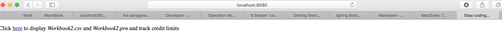
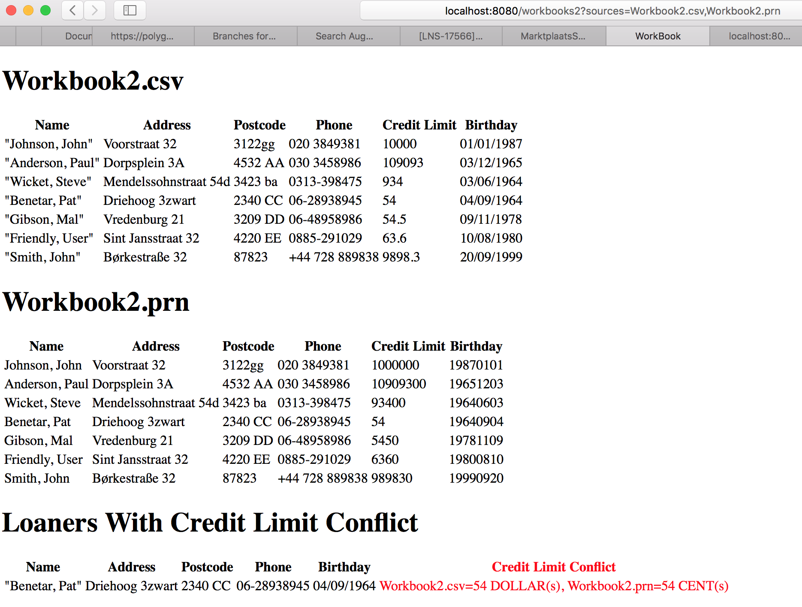

# BETest

## Why?

We are interested in your skills as a developer. As part of our assessment, we want to see your code.

## Instructions

In this repo, you'll find two files, Workbook2.csv and Workbook2.prn. These files need to be displayed in HTML format by the code you deliver. Please consider your work as a proof of concept for a system that can keep track of credit limits from several sources.

This repository is created specially for you, so you can push anything you like. Please update this README to provide instructions, notes and/or comments for us.

## The Constraints

Please complete the test within 5 business days. Use any language / libs / tools you like.

## Questions?

If you have any questions please send an email to DL-eCG-NL-assessment@ebay.com.

## Finished?

Please send an email to DL-eCG-NL-assessment@ebay.com let us know you're done.

Good Luck!

# Fedor's Notes
## Building and Running Instructions

Solution is implemented in Java. Hence, to build and run it one need to have *Java8* installed. Optionally, you can have Maven installed. Maven Wrapper is checked in into repo, if you don't have maven you can use it.

**Before running app, ensure that port 8080 is free. One can use `server.port` system property to override default 8080 port**

Go into repo root and run:

```
./mvnw spring-boot:run
```

The command downloads maven(if required, only first time), builds and runs workbook web-app. If everything goes well, last line in the console will be

```
 INFO 8407 --- [           main] s.b.c.e.t.TomcatEmbeddedServletContainer : Tomcat started on port(s): 8080 (http)
 INFO 8407 --- [           main] com.ebay.assignment.WorkbookApplication  : Started WorkbookApplication in 2.272 seconds (JVM running for 4.669)
```

## Testing Workbook web-app
Open your browser and go to ```http://localhost:8080``` address. Following page should appear



click to the link, page should be redirected to ```http://localhost:8080/workbooks2?sources=Workbook2.csv,Workbook2.prn``` and following main page should be displayed


## Design Decisions and Assumptions
Web-app(based on Spring Boot) is chosen over batch processing to facilitate displaying of HTML doc.  
As Instructions say
> consider your work as a proof of concept for a system that can keep track of credit limits from several sources.

the system not only displays *Workbook2.csv* and *Workbook2.prn*, but also finds loaners with credit conflicts and displays them. Also solution favors extensibility: it is very easy to add new credit limit source without touching main business-logic. Specifically, to add new source a developer should only:

* Implement `WorkbookParser.java` interface(or extend `AbstractWorkbookFileParser.java` if new source is textfile)  
* register new parser and type it handles in contructors `ParserBuilder.java`  
* adjust view `workbooks_and_conflicts.html` accordingly(although it can be designed to accomodate arbitrary number of workbooks to display)

I have also added API endpoint `/workbooks2/api/conflicts` returning credit conflicts in JSON to support possible front-end clients and facilitate integration testing, see `WorkbookAppIntegrationTest.java`.  
```
$ curl http://localhost:8080/workbooks2/api/conflicts?sources=Workbook2.csv,Workbook2.prn
```
yields
```
[{"loaner":{"name":"\"Benetar, Pat\"","address":"Driehoog 3zwart","postcode":"2340 CC","phone":"06-28938945","creditLimit":"54","birthday":"04/09/1964","originWorkbook":"Workbook2.csv"},"loanerWithCreditConflict":{"name":"Benetar, Pat","address":"Driehoog 3zwart","postcode":"2340 CC","phone":"06-28938945","creditLimit":"54","birthday":"19640904","originWorkbook":"Workbook2.prn"},"conflictingWorkbookOrigin":"Workbook2.prn","workbookOrigin":"Workbook2.csv","conflictingCreditLimit":{"amount":54,"nomenation":"CENT"},"creditLimit":{"amount":54,"nomenation":"DOLLAR"}}]
```

Credit Limit sources are loaded and parsed concurrently to improve perofrmance. Conflicts are also searched concurrently.

*Workbook2.csv* and *Workbook2.prn* are moved from root to the `src/main/resources` folder
## Error handling
* if line in *Workbook2.csv* or *Workbook2.prn* could not be parsed, it is logged and ignored
* if a source could not be loaded, it is logged and ignored. Loading of other resoures is not impacted.

Copyright (C) 2001 - 2017 by Marktplaats BV an Ebay company. All rights reserved.
